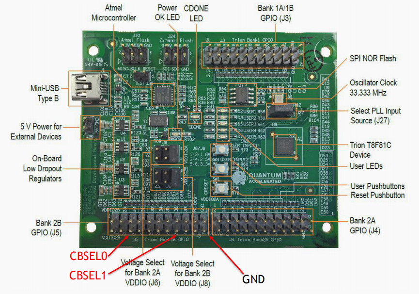

# multiple_image_T8F81
 How to build multi_image FPGA design on Trion T8


  ```
  .--,       .--,
 ( (  \.---./  ) )
  '.__/o   o\__.'
     {=  ^  =}
      >  -  <
  __.""`-------`""._____
 /                      \
 \ multiple_image_T8F81 /
 /                      \
 \______________________/
    ___)( )(___
   (((__) (__)))


    ____   ___ ____   ___         ___ ____   ___  _  _   
   |___ \ / _ \___ \ / _ \       / _ \___ \ / _ \| || |  
     __) | | | |__) | | | |_____| | | |__) | | | | || |_
    / __/| |_| / __/| |_| |_____| |_| / __/| |_| |__   _|
   |_____|\___/_____|\___/       \___/_____|\___/   |_|  


  ```
  ## Description

  > 项目目的：

  通过这个项目， 来快速了解如何使用Efinix FPGA内部的Config selection实现多镜像配置

  Trion T4/T8 FPGA在上电初始的时候会读取CSEL0，CSEL1两个管脚状态， 根据四种不同的状态， 来加载存在SPI Flash中的一个配置文件。 不需要消耗设计资源

  对于同平台产品的不同设计， 可以将设计存在同一个Flash， 因为现在Flash的存储容量对于T8FPGA可以容纳多个设计imag。 依靠板上的MCU，或者是拨码开关来决定加载什么样的功能。 甚至可以采用一个映像是测试工程， 另外的是用户模式的方法。


  This repo focus on introduction Efinix Trion Series T8 FPGA multi_image
  - README.md  the project readme file
  - Efinix 的官网是 www.efinixinc.com

  Efinix FPGA 的第一个低成本FPGA家族是 Trion :
  - you can register to access the documentation
  - we will provide the EVB and software for your evaluation.
  - ...


  ## Trion FPGA Family

  ```
    T4,T8 configuation multi_image pin is not inside of chip
    T20~T120, the configuation multi_image pin is inside of chip

  - FPGA lower than 30mw
    - T4,T8      : 4K , 8K  pure soft logic fabric product
    - Package    : 5x5mm FBGA81, 55 GPIOs
    - EVB        :
      - T8EVB with build in programmer, you only need PC with USB
      -
  -
  ```

  ## Software

  On Ubuntu 16LTS : Efinix provide the Free FPGA develop suit, you need register it and buy one piece of EVB

  ```sh

  这个案例基于Efinity 2019.3
  ```
  Other features :

  - Efinity 2018.4, we use the Version 2018.4 test the project, you can use Efinity 2019.3 or other advanced version

  ## Hardware

  - The Project is based on Efinix T8F81 EVB, its main features is as follows:

  -
  


  ## Project name


  - STEP1: install Efinity 2018.4 or other advanced version in Win or Ubuntu
  - STEP2: get ready of the T8F81 EVB,  you need two lines cable for CBSEL signal

      - if you have same EVB with Efinix engieers, with the other words, it is easy to find the issue with same two boards when you need tech support.

  - STEP3: download the total repository directory into Efinity project directory, for examples, C:\Efinity\2019.3\project\multiple_image_T8F81

  - STEP4: open the Efinity project of helloworld

  - STEP5: download the FPGA design T8_multi.hex into FPGA, it is all set

  - 四个FPGA镜像合成的文件 T8_multi.hex
  - 如何生成的四个镜像合并在文档的pdf文件中详细描述
  - multix4.rpt显示了不同的imag的区间和Flash的开始和结束地址

```

  *** Efinity Programming Tool Generation Report *****

  Time: 2020-02-04 15:57
  Generated Multi Image output file: C:\Efinity\2018.4\project\multiple_image_programming\helloworld\outflow\T8_multi.hex
  Device: T8/T4
  Image type: external
  CBSEL[1:0]  Flash Address  Length      Input Image File
       2'b00  0x00000000     0x0002a544  C:/Efinity/2018.4/project/multiple_image_programming/helloworld/outflow/helloworld_8.hex
       2'b01  0x0002b000     0x0002a544  C:/Efinity/2018.4/project/multiple_image_programming/helloworld/outflow/helloworld_10.hex
       2'b10  0x00056000     0x0002a544  C:/Efinity/2018.4/project/multiple_image_programming/helloworld/outflow/helloworld_12.hex
       2'b11  0x00081000     0x0002a544  C:/Efinity/2018.4/project/multiple_image_programming/helloworld/outflow/helloworld_14.hex

```

  - 通过将J5上的pin CBSEL0，CBSEL1进行与GND的短接可以有四种加载组合。 请参见应用文档

  ## Documentation

  系统中的文档参考了，注册Efinix用户后， 可以下载更加详细的应用指南
  在application note目录里有应用解释

  - an010-using-internal-reconfiguration-feature-v1.0.pdf（需注册用户）


  - Efiniy多镜像原理及用途.pdf  
  - T8EVB_multiimage.jpg  
  - T8_Multi_image.pdf

  ## Project Verilog file list

  - helleoworld.v  

  每个设计镜像就是改变helloworld.v中的delay参宿


  ## Verilog parameter

  - CBSEL 就是imag选择的管脚，T4,T8的是将其外接的
  - 分别改动如下代码中的**DELAY_SIZE** 为8,10,12,14
  - 每次改动重新编译， 生成一个新的hex文件， 在outflow目录下
  
```verilog

  module helloworld (led, clk, rstn);//reverse);
     parameter DELAY_SIZE = 10; //12 in normal, 14 is slow,10 is quick,8 is fast
     parameter WIDTH = 5;

```


  ## Update

  -Feb-4-2020, test all code with Efinity Ver 2019.3.272

   Tester by Ben Chen in Windows, test in T8F81 EVB

   Compiler by Wisdom Zhang in Ubuntu16


  ## Acknowledge

  Project Test by Ben Chen
  Project upload by Wisdom Zhang

  Anything question: email: 909614802 at qq dot com
  ```
   _____  __ _       _      
  | ____|/ _(_)_ __ (_)_  __
  |  _| | |_| | '_ \| \ \/ /
  | |___|  _| | | | | |>  <
  |_____|_| |_|_| |_|_/_/\_\
  ```
